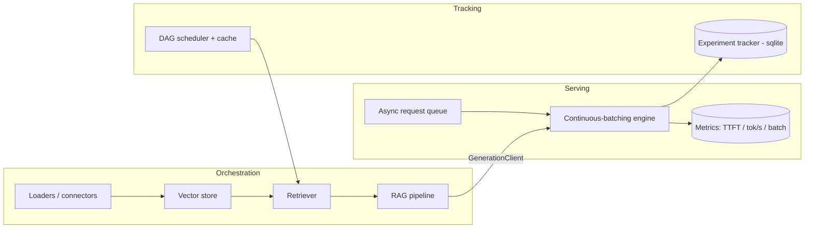

# ML-infra

A compact, **runnable** ML-infrastructure showcase. It implements — in pure, CPU-only
Python — the three layers an MLE platform team owns, modeled on the projects engineers
contribute to daily:

| Layer | Modeled on | What it demonstrates |
|-------|-----------|----------------------|
| **Serving** (`mlinfra.serving`) | vLLM, HF TGI | Async **continuous batching**, KV-cache-style per-request state, token streaming (SSE), live throughput/TTFT metrics |
| **Orchestration** (`mlinfra.orchestration`) | LangChain, LlamaIndex | A **RAG pipeline** from composable parts: loaders/connectors, vector store, retriever, serving client |
| **Tracking** (`mlinfra.tracking`) | MLflow, ZenML | sqlite **experiment tracking** + a **DAG scheduler** with content-hash step caching |
| **CUDA** (`mlinfra.cuda`) | vLLM/TGI custom kernels | Real kernels in **CUDA C++ (NVRTC)**, **Python (numba)**, and **Triton** — compiled to PTX on CPU; GPU-gated launch |

The layers compose into one story: the orchestration layer calls the serving layer; the
tracking layer records serving and pipeline metrics.

Everything runs **offline, CPU-only, with no GPU and no API keys**. Heavy integrations
(`transformers`, `sentence-transformers`, `anthropic`, `boto3`) are optional adapters loaded
lazily — they are never required to run the project or its tests.

## Architecture



## Quickstart

```bash
make install          # pip install -e ".[dev]"
make test             # pytest across all three layers (offline)
make bench            # end-to-end: scheduler + engine + RAG + tracking report
```

### Run the serving API

```bash
make run-server       # uvicorn on 127.0.0.1:8000
curl localhost:8000/health
curl -N -X POST localhost:8000/generate/stream \
     -H 'content-type: application/json' \
     -d '{"prompt": "hello", "max_tokens": 12}'
curl localhost:8000/metrics
```

### RAG demo (fully in-process)

```bash
python examples/rag_demo.py
```

## Design notes

- **Continuous batching** (`serving/engine.py`): a single async loop admits waiting requests
  into the running batch as they arrive and advances every in-flight request one token per
  tick — so throughput scales with batch size while each request streams independently. This
  is the core idea behind vLLM/TGI, expressed as systems code rather than CUDA kernels.
- **Pluggable backends** (`serving/backends.py`): the default `MockModelBackend` is
  deterministic and dependency-free; `HFModelBackend` and `AnthropicBackend` are optional
  adapters behind `try/except`.
- **Composable RAG** (`orchestration/`): `Loader → VectorStore → Retriever → RAGPipeline`,
  backend-agnostic via a small `GenerationClient` protocol (in-process or HTTP).
- **Caching scheduler** (`tracking/scheduler.py`): `@step` functions wired into a DAG by
  parameter name, run in topological order, with outputs cached by a content hash of the
  step source plus its inputs — re-running unchanged steps is a cache hit.

## CUDA kernels (compile on CPU, launch on GPU)

`mlinfra.cuda` ships real CUDA C++ kernels (`saxpy`, a shared-memory **tiled GEMM**, and a
numerically-stable **fused softmax** — the building blocks of a transformer block). The
compiler toolchain installs as pip wheels, so kernels compile **all the way to PTX and SASS
on a CPU-only machine** — no GPU required:

```bash
pip install -e ".[cuda]"            # NVRTC + ptxas wheels
python examples/cuda_compile_demo.py
# fused_softmax  arch=compute_75  PTX=3467B  ~instrs=102  cubin=5536B (SASS)
# tiled_gemm     arch=compute_75  PTX=4721B  ~instrs=126  cubin=4256B (SASS)
# GPU available for launch: False
```

```python
from mlinfra.cuda import compile_kernel, ptx_to_cubin, gpu_available
res = compile_kernel("tiled_gemm")      # CUDA C++ -> PTX (via NVRTC)
cubin = ptx_to_cubin(res.ptx, "sm_75")  # PTX -> SASS (via ptxas)
```

### Three ways to write a kernel

The same softmax/elementwise kernels are provided in all three languages MLE platform teams
actually use, so you can compare them:

| Path | Module | Extra | CPU-compilable? |
|------|--------|-------|-----------------|
| CUDA C++ | `mlinfra.cuda.compile` (`kernels/*.cu`) | `[cuda]` | ✅ via NVRTC |
| Python   | `mlinfra.cuda.numba_kernels` | `[numba]` | ✅ via numba-cuda + NVVM |
| Triton   | `mlinfra.cuda.triton_kernels` | `[triton]` | ❌ GPU backend only |

```python
# numba: write the kernel in Python, compile to PTX on CPU (no GPU)
from mlinfra.cuda import compile_softmax_ptx
ptx = compile_softmax_ptx(cc=(8, 0))    # -> '.target sm_80 ...'

# triton: defined on CPU, compiled+launched on a GPU
from mlinfra.cuda.triton_kernels import softmax, triton_gpu_ready
```

```bash
pip install -e ".[numba]" && python examples/numba_compile_demo.py
# saxpy        cc=8.0  PTX=11342B  .target sm_80
# softmax_rows cc=9.0  PTX=15336B  .target sm_90
```

**What runs where:** compilation of the CUDA C++ and numba kernels is CPU-only and CI-tested.
*Launching* any kernel (`mlinfra.cuda.runtime`, numba/Triton host wrappers) needs an actual
GPU + driver (`libcuda.so`); those entry points check `gpu_available()` / `triton_gpu_ready()`
and raise or skip cleanly otherwise. The GPU-gated tests run in the separate `GPU` workflow
(`.github/workflows/gpu.yml`) on a self-hosted GPU runner, so CPU CI stays green.

### Kernel benchmark (closes the loop with tracking)

`mlinfra.cuda.bench` is a correctness + performance harness. The engine (`benchmark_impls`)
is backend-agnostic and CPU-unit-tested; `run_softmax_benchmark` runs a real **Triton vs numba
vs torch/cuBLAS** row-softmax shootout on a GPU, validates each against the torch reference,
and logs latency / throughput / max-error to the **MLflow-style tracker**:

```bash
python examples/kernel_bench.py     # GPU host; runs in the `GPU` workflow
# illustrative output (actual numbers depend on the GPU):
# impl            ok      mean_ms    p50_ms   Gitem/s     max_err
# triton          yes      0.1820    0.1791     46.10    7.45e-07
# torch_cublas    yes      0.2014    0.1998     41.66    0.00e+00
# numba           yes      0.3957    0.3901     21.20    9.54e-07
# Logged to experiment 'kernel-bench' in mlruns.db
```

So a kernel change shows up as a tracked experiment run, the same way the RAG benchmark does —
the CUDA, serving, and tracking layers all feed the one tracker.

## Optional extras

```bash
pip install -e ".[hf]"          # transformers backend
pip install -e ".[embeddings]"  # sentence-transformers embeddings
pip install -e ".[anthropic]"   # Anthropic API backend
pip install -e ".[cuda]"        # NVRTC + ptxas (CUDA C++ -> PTX/SASS on CPU)
pip install -e ".[numba]"       # numba-cuda (Python kernels -> PTX on CPU)
pip install -e ".[triton]"      # triton + torch (GPU-only kernels)
```

## Layout

```
src/mlinfra/serving/        # engine, backends, FastAPI server, schemas
src/mlinfra/orchestration/  # loaders, vector store, retriever, client, pipeline
src/mlinfra/tracking/       # tracker, metrics registry, DAG scheduler
src/mlinfra/cuda/           # CUDA C++/numba/Triton kernels, compilers, GPU-gated runtime
examples/                   # run_server, rag_demo, benchmark, cuda/numba compile demos
tests/                      # one suite per layer
```
